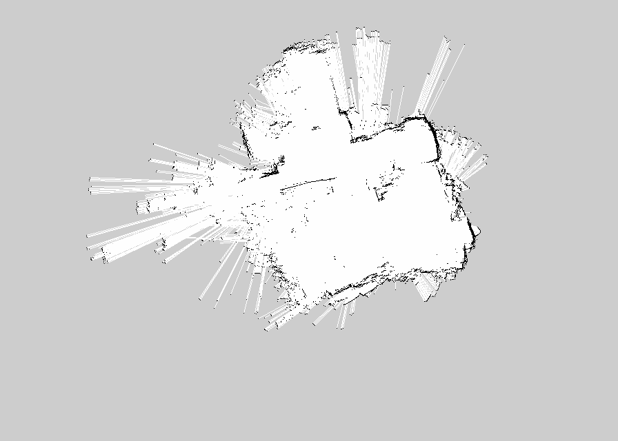
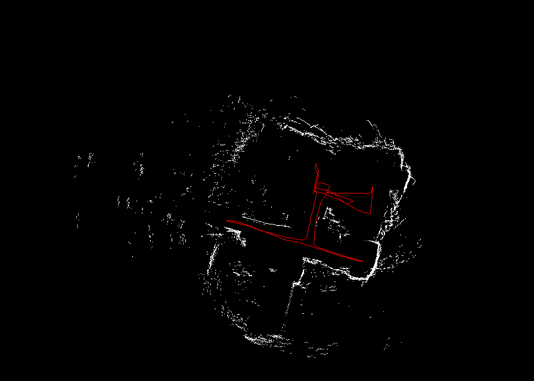
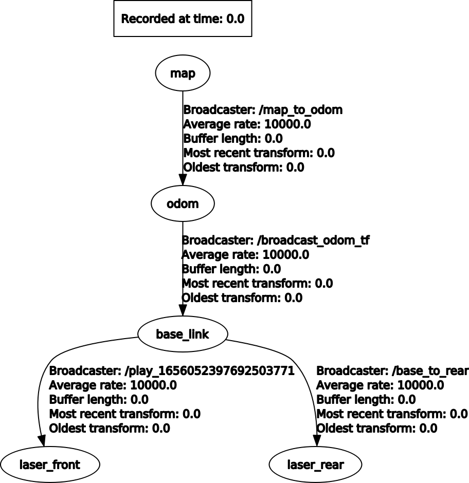

# Robotics Project 2

The second project for the Robotics course at Politecnico di Milano, academic year 2021/2022.

## Team

| Student ID | Name    | Surname  |
| ---------- | ------- | -------- |
| 10754004   | Mahdieh | Jalali   |
| 10574957   | Silvia  | Lombardo |
| 10653349   | Alberto | Mosconi  |

## Project structure

- `CMakeLists.txt`: the configuration for the cmake compiler, defines how to build the code.
- `package.xml`: the package manifest, defines the package's properties.
- **`config/`**
  - `mapping.rviz`: the configuration for visualizing the mapping progress in Rviz.
  - `amcl.rviz`: the configuration for visualizing the robot localization in Rviz.
- **`images/`**:
  - `tf-tree.png`: image of the structure of the TF tree.
  - `map.png`: png version of the map obtained by mapping with the second bag.
- **`launch/`**
  - `mapping.launch`: the launch file for the map creation step, it runs gmapping and other required nodes.
  - `localization.launch`: the launch file for the localization step, it starts amcl and other required nodes.
- **`maps/`**
  - `map.pgm`: the map generated by gmapping by running the second bag.
  - `map.yaml`: the map metadata relative to `map.pgm`.
  - `map_with_trajectory_bag1.png`: the map with trajectory generated by amcl by running the first bag.
  - `map_with_trajectory_bag3.png`: the map with trajectory generated by amcl by running the third bag.
- **`src/`**
  - `broadcast_odom_tf.cpp`: ROS node responsible for brodcasting the odometry messages to their respective TF frame.
  - `save_map_trajectory.cpp`: ROS node that advertises the service for saving the map with trajectory.
- **`srv/`**
  - `save_map_trajectory.srv`: the specification of the request and response of the service responsible for saving the map with trajectory.

## Dependencies

The following packages must be installed.

- [**`OpenCV`**](https://opencv.org/): Open Source Computer Vision Library, used for drawing lines on the map image.

  ```
  sudo apt install libopencv-dev python3-opencv
  ```

- [**`ira_laser_tools`**](https://wiki.ros.org/ira_laser_tools): utils for lasers, like listen to different laser scan sources and merge them in a single scan or generate virtual laser scans from a pointcloud.

  ```
  sudo apt install ros-melodic-ira-laser-tools
  ```

- [**`grid_map`**](https://wiki.ros.org/grid_map): manage two-dimensional grid maps, provides an iterface between OccupancyGrid and OpenCV images.
  ```
  sudo apt install ros-melodic-grid-map
  ```

## How to run

Instructions for running the mapping process, the localization process and for saving the trajectory map.

### Mapping

bag used: **`second bag`**

To obtain the map run the launch file with the following command:

```
roslaunch project2 mapping.launch
```

and play the second bag.



### Localization

bags used: **`first and third bags`**

To execute localization run the launch file with the following command:

```
roslaunch project2 localization.launch
```

and play either the first or third bag.

### Saving trajectory

To save an image of the map with the robot's trajectory, when running the localization step a service can be called:

```
rosservice call /save_map_trajectory
```

this will save the image in the `maps` folder.




## TF Tree


